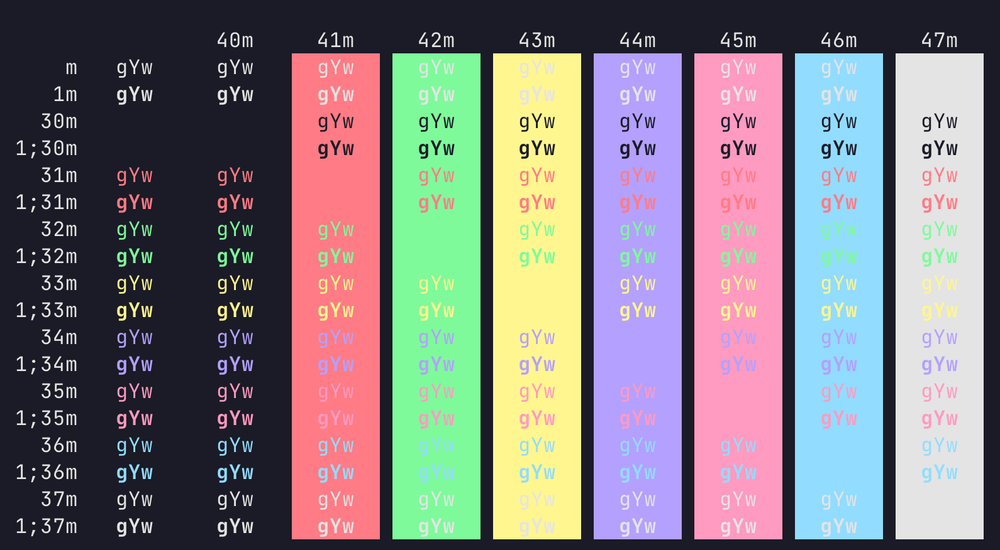

# Night Owlish dark theme for Ghostty

A port of [Night Owl VS Code theme](https://github.com/sdras/night-owl-vscode-theme) for Ghostty. Inspired by [iTerm 2 Night Owl theme](https://github.com/nickcernis/iterm2-night-owl).

## Installation

1. [Download Night Owlish dark theme for Ghostty](https://github.com/silppuri/ghostty-night-owl-darkish-theme/archive/refs/heads/main.zip).
1. Install [Ghostty](https://github.com/ghostty-org/ghostty).
1. Launch Ghostty.
1. Open settings (Cmd + ,)
1. Add following setting: `theme = "/<download path>/ghostty-night-owl-theme/Night Owl Dark"`
1. Save settings and restart Ghostty.
